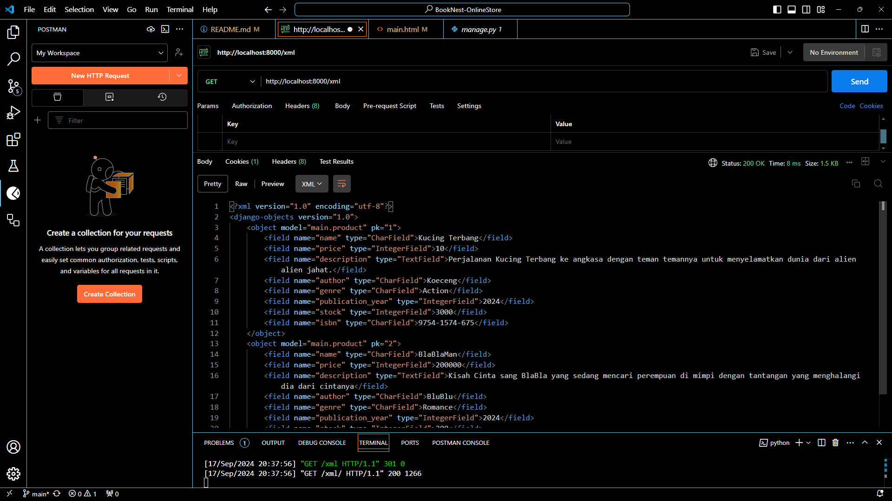
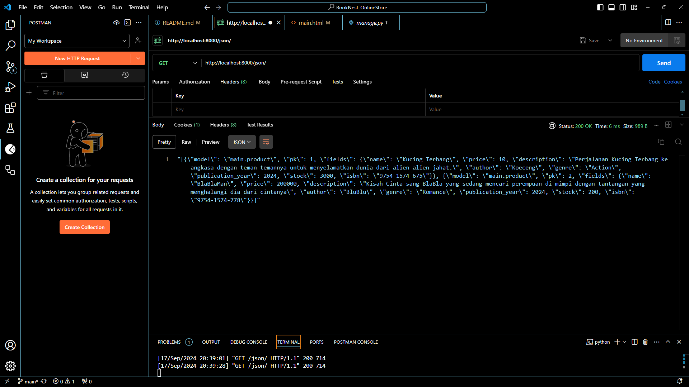

# BookNest Online Store 

ini bagian pembenaran tidak terpatok dealine
Hanya ingin benerin saja tidak enak apabila belum selesai :3
untuk tugas ada di branch satu lagi

## Tautan Aplikasi PWS yang Sudah Dideploy
Aplikasi PWS dapat diakses melalui tautan berikut:
[BookNest Online Store Deployment](https://laurentius-farel-booknestonlinestore2.pbp.cs.ui.ac.id)

---

## Jawaban Pertanyaan (Tugas 2)

### 1. Implementasi Checklist Secara Step-by-Step

Untuk mengimplementasikan checklist di atas, saya melakukan langkah-langkah berikut:

1. **Mempersiapkan Lingkungan Pengembangan**:
   - Menginstal **Python** dan **Django**.
   - Mengatur **virtual environment** untuk memastikan dependencies proyek terisolasi.
   
2. **Membuat Project Django**:
   - Menjalankan `django-admin startproject BookNest` untuk membuat project baru.
   
3. **Membuat Aplikasi Django**:
   - Menambahkan aplikasi utama menggunakan perintah `python manage.py startapp store`.

4. **Membangun Model**:
   - Membuat model produk buku di `models.py` untuk menyimpan data buku seperti judul, pengarang, dan harga.
   
5. **Mengatur Views dan URL**:
   - Menghubungkan model dengan views di `views.py` untuk menampilkan data buku ke halaman HTML.
   - Mengkonfigurasi `urls.py` agar request dari pengguna diarahkan ke views yang sesuai.

6. **Mendeploy Aplikasi**:
   - Menggunakan **Heroku** atau **Vercel** untuk mendeploy aplikasi ke server live.
   - Menghubungkan dengan **PostgreSQL** sebagai database di deployment environment.

### 2. Bagan Request-Response Django


Bagan di atas menunjukkan alur request dan response antara client dan server pada aplikasi Django:

1. **Client** mengirimkan request ke server melalui URL tertentu.
2. **urls.py** bertanggung jawab mengarahkan request ke view yang sesuai berdasarkan pola URL.
3. **views.py** memproses request, mengambil data dari **models.py** (basis data) jika diperlukan.
4. Setelah data diproses, **views.py** akan merender template HTML dan mengirim response kembali ke client.

Kaitan antara komponen:
- **urls.py**: Mengatur routing request.
- **views.py**: Memproses logika aplikasi dan berinteraksi dengan model.
- **models.py**: Menyimpan dan mengambil data dari database.
- **HTML**: Template untuk menampilkan data di browser.

### 3. Fungsi Git dalam Pengembangan Perangkat Lunak

**Git** adalah sistem kontrol versi yang sangat penting dalam pengembangan perangkat lunak karena beberapa alasan:

- **Versi Kontrol**: Git melacak perubahan pada kode, memungkinkan pengembang untuk kembali ke versi sebelumnya jika ada kesalahan.
- **Kolaborasi**: Git memungkinkan beberapa pengembang untuk bekerja bersama dalam satu proyek tanpa konflik.
- **Manajemen Branch**: Pengembang dapat membuat branch untuk fitur baru, menguji, dan menggabungkannya ke branch utama setelah diuji.

### 4. Mengapa Framework Django Digunakan dalam Pembelajaran Pengembangan Perangkat Lunak?

Django sering digunakan sebagai framework awal karena:

- **Batteries-included**: Django menyediakan banyak fitur bawaan seperti ORM, form, autentikasi, dan admin panel, sehingga memudahkan pengembangan aplikasi web.
- **Arsitektur yang Jelas**: Django mengikuti pola **Model-View-Template (MVT)** yang memisahkan logika bisnis dari tampilan dan data.
- **Komunitas yang Besar**: Django memiliki dokumentasi yang baik dan komunitas yang aktif, membantu dalam pembelajaran dan pengembangan lebih lanjut.

### 5. Mengapa Model pada Django Disebut sebagai ORM?

Django menggunakan ORM (**Object-Relational Mapping**) untuk memetakan model ke database. ORM memungkinkan pengembang untuk:

- Menulis logika database menggunakan **Python** alih-alih menggunakan **SQL** langsung.
- Mengabstraksikan detail dari berbagai database, sehingga mempermudah pengembang dalam bekerja dengan database tanpa harus menulis query SQL yang berbeda untuk setiap database.
- ORM otomatis menangani banyak tugas CRUD (Create, Read, Update, Delete), sehingga lebih efisien dan mengurangi kemungkinan error.

---

## Jawaban Pertanyaan (Tugas 3)

### 1. Jelaskan mengapa kita memerlukan data delivery dalam pengimplementasian sebuah platform?
Data delivery diperlukan dalam sebuah platform untuk memungkinkan pertukaran data antara client dan server, atau antara berbagai aplikasi yang saling terhubung. Dalam konteks aplikasi web, data delivery memungkinkan komunikasi antara backend (server) yang mengelola database dan frontend (antarmuka pengguna) yang menampilkan informasi kepada pengguna.

 - Contohnya, ketika pengguna mengisi form untuk menambahkan produk, data tersebut harus dikirim dari browser pengguna (client) ke server, diproses, dan disimpan ke dalam database. Data delivery juga diperlukan saat menampilkan informasi seperti daftar produk, yang diambil dari server dan dikirim ke frontend dalam format seperti JSON atau XML agar dapat ditampilkan dengan benar kepada pengguna.

### 2. Menurutmu, mana yang lebih baik antara XML dan JSON? Mengapa JSON lebih populer dibandingkan XML?
JSON umumnya lebih baik dan lebih populer dibandingkan XML dalam konteks aplikasi web modern. Berikut alasannya:

 - Sintaks yang lebih sederhana: JSON memiliki struktur yang lebih ringkas dan mudah dipahami manusia maupun mesin dibandingkan XML yang memiliki markup lebih kompleks.
 - Ukuran data lebih kecil: JSON tidak membutuhkan banyak tag seperti XML, sehingga menghemat ruang dan bandwidth.
 - Kompatibilitas: JSON lebih mudah digunakan dan didukung oleh banyak bahasa pemrograman modern. JSON adalah format native untuk JavaScript, yang menjadikannya pilihan default dalam banyak aplikasi web.
 - Kecepatan: Parsing data JSON lebih cepat dibandingkan XML karena strukturnya lebih sederhana.
 - XML masih digunakan dalam beberapa aplikasi enterprise atau di lingkungan yang membutuhkan data dengan skema yang lebih kaya (misalnya, dengan namespace atau tipe data kompleks), tetapi dalam banyak aplikasi web modern, JSON menjadi pilihan utama karena efisiensi dan kesederhanaannya.

### 3. Jelaskan fungsi dari method is_valid() pada form Django dan mengapa kita membutuhkan method tersebut?
Method is_valid() dalam Django digunakan untuk memvalidasi data yang diinputkan melalui form. Fungsinya adalah untuk memastikan bahwa data yang dimasukkan sesuai dengan aturan validasi yang telah ditentukan dalam model atau form Django.

 - Jika valid, is_valid() mengembalikan True, yang berarti data dapat diproses lebih lanjut, misalnya disimpan ke dalam database.
 - Jika tidak valid, is_valid() akan mengembalikan False, dan Django akan memberikan pesan kesalahan yang dapat ditampilkan kembali kepada pengguna.

Metode ini diperlukan untuk menghindari penyimpanan data yang tidak sah atau tidak sesuai dengan format yang diinginkan; contohnya, data tidak ada dalam kolom yang harus ada atau data yang tidak memenuhi tipe data yang ditentukan dalam model.

### 4. Mengapa kita membutuhkan csrf_token saat membuat form di Django? Apa yang dapat terjadi jika kita tidak menambahkan csrf_token pada form Django? Bagaimana hal tersebut dapat dimanfaatkan oleh penyerang?
csrf_token (Cross-Site Request Forgery token) adalah langkah keamanan yang disediakan Django untuk melindungi aplikasi dari serangan CSRF (Cross-Site Request Forgery). Ini adalah token unik yang dikaitkan dengan sesi pengguna dan diverifikasi oleh server setiap kali pengguna mengirim permintaan POST (misalnya, saat mengirim form).

 - Jika tidak ada csrf_token, form yang dikirimkan dapat menjadi target serangan CSRF, di mana penyerang dapat memanipulasi sesi pengguna dan memaksa pengguna untuk melakukan tindakan yang tidak diinginkan tanpa sepengetahuan mereka. Misalnya, penyerang bisa membuat pengguna mengirimkan data palsu atau melakukan perubahan pada akun pengguna tanpa izin.
 - Penyerang dapat memanfaatkan form tanpa csrf_token dengan mengirimkan permintaan POST dari situs lain yang secara otomatis dijalankan oleh browser pengguna tanpa sepengetahuan mereka.

### 5. Jelaskan bagaimana cara kamu mengimplementasikan checklist di atas secara step-by-step (bukan hanya sekadar mengikuti tutorial).
Berikut langkah-langkah yang saya lakukan untuk mengimplementasikan checklist tugas ini:

 - Membuat model Product:

    - Saya memulai dengan membuat model Product di models.py, mendefinisikan semua atribut yang diperlukan seperti name, price, description, author, genre, publication_year, stock, dan isbn.
 - Membuat form ProductForm:

    - Setelah model selesai, saya membuat form ProductForm di forms.py menggunakan ModelForm, yang secara otomatis menghasilkan field dari model Product.
 - Membuat view show_main:

    - Saya membuat view show_main yang menampilkan form dan daftar produk. View ini menangani input form menggunakan method POST dan menampilkan daftar produk dari database menggunakan context yang di-render ke template main.html.
 - Menambahkan CSRF token:

    - Dalam template form, saya menambahkan tag {{ csrf_token }} untuk memastikan keamanan dari serangan CSRF.
 - Menambahkan view untuk JSON dan XML:

    - Saya menambahkan views untuk menampilkan data produk dalam format JSON dan XML, baik untuk semua produk maupun untuk produk berdasarkan ID. View ini menggunakan Django's serializers untuk mengubah data produk menjadi format JSON atau XML.
 - Menambahkan routing URL:

    - Saya menambahkan routing di urls.py untuk menghubungkan views ke URL yang sesuai. Ini termasuk routing untuk form (show_main) serta views JSON dan XML.
 - Menguji hasil dengan Postman:

    - Saya menguji URL yang menampilkan data dalam format JSON dan XML menggunakan Postman, memastikan data tampil dengan benar dalam kedua format tersebut.
   
### Gambar-Gambar






## Jawaban pertanyaan (Tugas 4)

### Jelaskan perbedaan antara HttpResponseRedirect() dan redirect() di Django?

 - **`HttpResponseRedirect()`**: Merupakan class Django yang digunakan untuk membuat HTTP response yang mengarahkan pengguna ke URL tertentu. Ini membutuhkan URL lengkap sebagai parameter.
 - **`redirect()`**: Merupakan shortcut function Django yang menerima URL, nama view, atau objek model dan secara otomatis membuat `HttpResponseRedirect`. Ini lebih fleksibel dan mudah digunakan.

### 2. Jelaskan cara kerja penghubungan model `Product` dengan `User`!
Model `Product` dihubungkan dengan `User` menggunakan `ForeignKey` yang merujuk ke model `User`. Setiap produk memiliki pemilik (pengguna) yang terkait sebagai berikut:

```python
class Product(models.Model):
    owner = models.ForeignKey(User, on_delete=models.CASCADE)
    name = models.CharField(max_length=100)
    price = models.DecimalField(max_digits=10, decimal_places=2)
    # atribut lainnya
```

Relasi ini memungkinkan setiap produk memiliki satu pemilik, yaitu pengguna yang terhubung dengan produk tersebut.

### 3. Apa perbedaan antara authentication dan authorization?

 - Authentication: Verifikasi identitas pengguna (login). Jika berhasil, pengguna akan dianggap sebagai pengguna yang valid.
 - Authorization: Penentuan izin akses setelah pengguna terotentikasi. Ini menentukan tindakan atau data apa yang dapat diakses pengguna.
 - Proses Login di Django: Saat pengguna login, Django memverifikasi kredensial menggunakan authenticate() dan kemudian menyimpan sesi menggunakan login() jika valid. Setelah itu, otorisasi digunakan untuk menentukan hak akses.

### 4. Bagaimana Django mengingat pengguna yang telah login?

 - Django menggunakan session untuk mengingat pengguna yang telah login. Session ID disimpan dalam cookies, dan setiap kali pengguna mengunjungi situs, Django memeriksa cookies ini untuk mengenali pengguna.
 - Kegunaan Lain dari Cookies: Selain untuk login, cookies dapat menyimpan preferensi pengguna, data sesi, dan status keranjang belanja. Tidak semua cookies aman, terutama jika tidak dienkripsi dan berpotensi digunakan dalam serangan seperti XSS. Cookies aman harus menggunakan flag HttpOnly dan Secure.

### 5. Implementasi Checklist:

 - Membuat Model Product:
    - Membuat model Product yang memiliki atribut seperti name, price, description, dan owner (ForeignKey ke User).
 - Form & View ProductForm:
    - Membuat ProductForm untuk menerima input data produk dari pengguna.
 - View untuk Menampilkan Data:
    - Membuat view show_main untuk menampilkan form input produk dan daftar produk yang ada.
 - Menambahkan CSRF Protection:
    - Menambahkan csrf_token pada form di template untuk mencegah serangan CSRF.
 - JSON & XML View:
    - Membuat view untuk menampilkan data produk dalam format JSON dan XML.
 - Routing URL:
    - Menambahkan URL routing di urls.py untuk menghubungkan view dengan URL.
 - Pengujian:
    - Menguji fungsi view dan URL dengan Postman untuk memastikan data ditampilkan dengan benar dalam format JSON dan XML.

## Jawaban pertanyaan (Tugas 5)

### 1. Urutan Prioritas Pengambilan CSS Selector
CSS memiliki aturan spesifik untuk menentukan urutan prioritas (specificity) ketika ada beberapa selector yang diterapkan pada elemen HTML yang sama. Urutan prioritas tersebut adalah sebagai berikut:
- **Inline CSS**:  Nilai ini memiliki prioritas tertinggi karena didefinisikan langsung dalam atribut `style` di elemen HTML.
- **ID Selector**: Selector yang menggunakan ID (misalnya `#example`) memiliki prioritas tinggi. Setiap ID harus unik dalam halaman.
- **Class, Attribute, dan Pseudo-class Selector**: Selector ini memiliki prioritas lebih rendah daripada ID. Misalnya `.example`, `[type="text"]`, atau `:hover`.
- **Element Selector**: Selector yang menggunakan nama elemen HTML (misalnya `div`, `p`, `h1`) memiliki prioritas terendah.
- **Universal Selector**: Selector universal (`*`) juga memiliki prioritas terendah.

Jika ada konflik dalam CSS, browser akan mengikuti urutan prioritas di atas untuk menentukan gaya mana yang akan diterapkan pada elemen.

### 2. Pentingnya Responsive Design
Responsive design adalah konsep penting dalam pengembangan aplikasi web karena memungkinkan tampilan halaman web beradaptasi dengan berbagai ukuran layar dan perangkat. Ini penting karena semakin banyak pengguna mengakses internet melalui perangkat mobile, tablet, dan desktop.

#### Contoh Aplikasi:
- **Aplikasi yang Sudah Menerapkan Responsive Design**: 
  - **Twitter**: Halaman Twitter menyesuaikan tampilan baik di desktop maupun perangkat mobile, memungkinkan pengguna untuk mengakses konten dengan nyaman.
- **Aplikasi yang Belum Menerapkan Responsive Design**: 
  - Beberapa situs berita atau blog yang masih menggunakan layout statis tanpa menyesuaikan ukuran elemen untuk perangkat mobile, sehingga pengguna harus melakukan zoom in/out untuk membaca konten.

### 3. Perbedaan antara Margin, Border, dan Padding
- **Margin**: 
  - Ruang di luar elemen. Margin digunakan untuk menciptakan jarak antara elemen dan elemen lainnya. 
  - **Implementasi**: Menggunakan properti CSS `margin` seperti `margin: 10px;` untuk memberikan jarak 10 piksel di semua sisi.
  
- **Border**: 
  - Garis di sekitar elemen yang dapat memiliki ketebalan, warna, dan gaya. 
  - **Implementasi**: Menggunakan properti CSS `border` seperti `border: 1px solid black;` untuk memberikan border 1 piksel dengan warna hitam.
  
- **Padding**: 
  - Ruang di dalam elemen antara konten dan border. Padding digunakan untuk memberikan ruang di dalam elemen.
  - **Implementasi**: Menggunakan properti CSS `padding` seperti `padding: 10px;` untuk memberikan jarak 10 piksel di dalam elemen di semua sisi.

### 4. Konsep Flexbox dan Grid Layout
- **Flexbox**:
  - Flexbox adalah metode layout CSS yang memungkinkan desain elemen dalam satu dimensi (baris atau kolom). Ini mempermudah penyusunan dan penyelarasan elemen dalam kontainer.
  - **Kegunaan**: Sangat berguna untuk membuat layout responsif, menyeimbangkan ruang antar elemen, dan mengatur alignment dengan mudah.

- **Grid Layout**:
  - Grid layout adalah metode layout CSS yang memungkinkan desain elemen dalam dua dimensi (baris dan kolom). Ini memberikan kontrol lebih besar dalam mengatur ukuran dan posisi elemen di dalam grid.
  - **Kegunaan**: Ideal untuk membuat layout yang kompleks dengan struktur yang lebih terorganisir dan memudahkan pengaturan elemen dalam grid yang fleksibel.

### 5. Implementasi Checklist
Dalam mengimplementasikan checklist, saya mengikuti langkah-langkah berikut:
1. **Pemahaman Konsep**: Membaca dan memahami setiap konsep dari checklist yang harus diterapkan. Saya mencari referensi tambahan jika diperlukan.
2. **Eksperimen dengan CSS**: Mencoba berbagai selector CSS dan melihat bagaimana mereka berinteraksi dalam layout halaman web. Saya juga menguji berbagai kombinasi untuk memahami prioritas.
3. **Responsive Design**: Menerapkan responsive design dengan media queries. Saya menguji tampilan di berbagai perangkat untuk memastikan tampilannya baik di desktop maupun mobile.
4. **Penggunaan Margin, Border, dan Padding**: Menerapkan dan menguji properti CSS untuk margin, border, dan padding di elemen yang berbeda untuk memahami efeknya terhadap layout.
5. **Mencoba Flexbox dan Grid**: Mengimplementasikan layout dengan menggunakan flexbox dan grid. Saya bereksperimen dengan berbagai properti untuk mendapatkan hasil yang diinginkan.
6. **Review dan Perbaikan**: Setelah semua diterapkan, saya mereview tampilan aplikasi, memperbaiki masalah responsivitas, dan memastikan bahwa semua elemen berfungsi dengan baik.

## Jawaban Pertanyaan (Tugas 5)

### 1. Manfaat JavaScript dalam Pengembangan Web
JavaScript memungkinkan halaman web menjadi interaktif dan dinamis tanpa perlu memuat ulang. Ini meningkatkan pengalaman pengguna dengan memungkinkan pemrosesan asinkron dan interaktivitas langsung.

### 2. Fungsi `await` pada `fetch()`
`await` menunggu hasil dari `fetch()` sebelum melanjutkan ke kode berikutnya. Tanpa `await`, kode berikutnya dieksekusi sebelum hasil `fetch()` tersedia, yang dapat menyebabkan masalah jika data belum siap.

### 3. Alasan Penggunaan `csrf_exempt` pada AJAX POST
`csrf_exempt` digunakan untuk mengabaikan pengecekan CSRF pada view yang menangani request AJAX POST, terutama ketika token CSRF tidak disertakan dalam request. Tanpa ini, request akan ditolak.

### 4. Alasan Pembersihan Input Dilakukan di Backend
Validasi dan pembersihan di backend lebih aman karena input yang dikirim dari frontend bisa dimanipulasi. Backend memberikan lapisan keamanan ekstra untuk memastikan data yang masuk sudah sesuai standar.

### 5. Implementasi Checklist
1. **Form Modal**: Saya memulai dengan menambahkan modal pada halaman untuk menambah produk.
2. **AJAX Fetch**: Implementasi `fetch()` untuk menangani pengiriman form secara asinkron.
3. **CSRF Handling**: Menggunakan `csrf_exempt` pada view untuk menghindari masalah CSRF saat pengiriman POST via AJAX.
4. **Form Submission**: Modal ditutup setelah pengiriman form berhasil dan halaman diperbarui dengan produk baru tanpa reload.